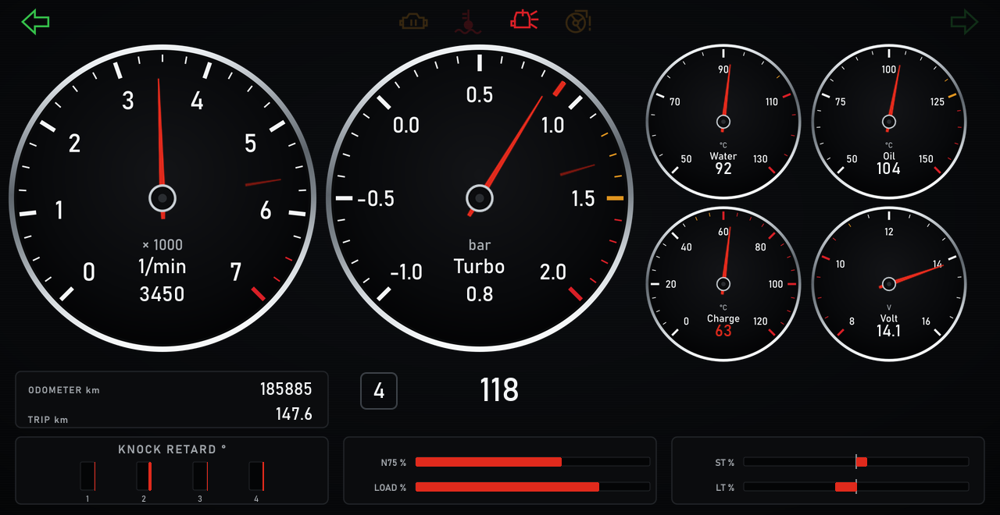
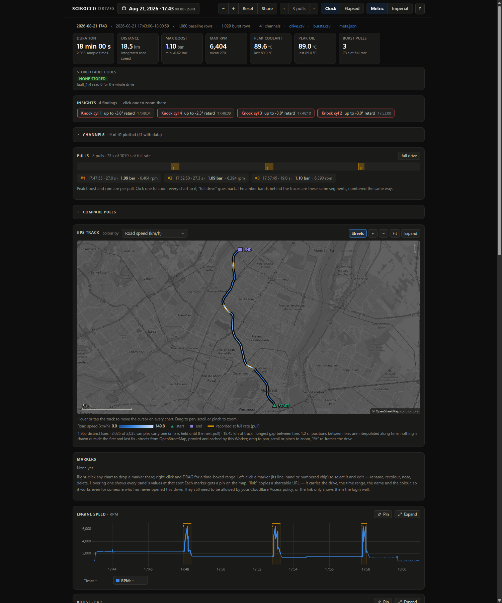

# Scirocco dash

Live engine data from a 2009 VW Scirocco 2.0 TSI on the car's Android head
unit, and a cloud dashboard of every drive.

A Feather M4 CAN on the OBD port polls the Bosch MED17.5 ECU over VW TP 2.0 /
KWP2000 at 15 to 18 Hz and streams RealDash frames over USB. On the head unit,
a small Python daemon in Termux feeds RealDash and logs every drive. Back on
home WiFi, the logs go to Cloudflare R2. A Cloudflare
Worker renders the drives: charts, full-rate pulls, GPS track, markers.

This is one person's build for one car, shared so another VW owner can see
how it was done and reuse the parts that fit. It is not a product. Read
"Compatibility" before buying anything.

## Screenshots

RealDash on the head unit, page 1 of 4 (1280x660, the deck keeps its Android
nav bar):

All four pages: cluster, engine and tuning, chassis, trip and diagnostics:

The cloud dashboard, shown here on synthetic test data (the GPS track is a
fabricated drive, see `cloud/testdata/`):

## Architecture

    OBD port (CAN-H, CAN-L, GND)
      |
    Adafruit Feather M4 CAN, CircuitPython          board/
      TP 2.0 + KWP2000 measuring blocks
      -> RealDash "44" frames on USB CDC serial
      |
    Android head unit ("the deck" in the docs)
      USB Serial Telnet Server app  owns the USB device, serves TCP 127.0.0.1:2323
      deck/tee.py  (Termux)         one client of that socket; serves RealDash on
                                    127.0.0.1:35000, writes per-drive CSV + raw log
      RealDash                      RealDash CAN -> WiFi/LAN -> 127.0.0.1:35000
                                    with board/scirocco_realdash.xml and
                                    dash/scirocco-v2.rd
      deck/upload.py                on the home SSID, pushes closed drives to R2
      deck/watchdog.sh              restarts all of the above; Termux:Boot starts it
      |
    Cloudflare R2 bucket  <-  cloud/  Worker + single-file dashboard (uPlot)

Two facts shape the whole design and are worth knowing before reading code:

1. Boost is not on any CAN bus in this car. Nothing on the vehicle needs
   charge pressure, so no module broadcasts it. It has to be polled from the
   ECU, and on a VAG car of this age that means KWP2000 measuring blocks
   carried over TP 2.0, not UDS.
2. The head unit is not rooted and will not be. An ordinary app owns the USB
   device and re-exposes it as a local TCP socket; everything else is plain
   Python in Termux.

## Compatibility

The protocol layer (`board/tp20.py`, `board/uds.py`) is generic VAG TP 2.0 /
KWP2000 and ISO-TP / UDS. The channel map is not. Everything in
`board/boost.py`, `board/scirocco_realdash.xml`, `deck/frame_schema.py` and
the dashboards is built on the measuring-block numbers, field positions and
formula IDs found on this specific ECU (MED17.5, part 06J906026AR, engine
code CAWB, EA888 Gen 1). Expect it to transfer with little change to other
EA888 Gen 1 cars on MED17.5 (Mk6 GTI CCTA/CBFA era). Expect to redo the
block map on anything else.

Cars whose engine ECU only speaks UDS (roughly MQB onward) will not work
with this code as-is. Service 0x22 gets no answer here, and that is the whole
reason the TP 2.0 path exists. `board/scanner_main.py` and the scripts in
`board/probes/` are the discovery tools that answered that question for this
car; run them first on yours.

Things that are known to be inferred or unverified on this car are marked as
such in `CLAUDE.md` and `docs/ENGINE-CHANNELS.md` (oil temperature, knock
retard scale, some formula IDs). Do not tune on them.

## Parts

Prices are rough and in CAD.

| Part | Notes | Approx. |
|---|---|---|
| Adafruit Feather M4 CAN Express | The board. Flash CircuitPython 10.x. | 40 |
| OBD-II male-to-female extension | Tap CAN-H (pin 6), CAN-L (pin 14) and GND (pin 4/5) off the extension, not the car. Never connect pin 16 (+12 V). | 15 |
| USB-C data cable | Feather to a head-unit USB port. The board is powered from it and sleeps with the ignition. | 10 |
| Android head unit with a USB host port | This one is a DUDU7 (UIS7870, Android 13). Network ADB and a USB host port are what matter. | already fitted |
| RealDash (Android) | From the Play Store. RealDash for Windows was used to build and edit the dashboard. | app price |
| Optional: Adafruit 2.13" tri-colour eInk FeatherWing | Status screen only (waiting for the car, peak hold). ~15 s per refresh, useless as a live gauge. Code runs without it. | 25 |
| Optional: NeoPixel strip, level shifter, buck converter | Shift and warning light bar. See `docs/PLAN-deck.md`. | 70 to 90 |

Accounts and software, all free tiers:

- Cloudflare: Workers, R2, Access. A custom hostname needs a zone in the same
  account; the workers.dev URL works without one.
- On the head unit: F-Droid, Termux, Termux:API, Termux:Boot, and the
  "USB Serial Telnet Server" app (package
  `com.clusterrr.usbserialtelnetserver`).
- On the laptop: Python 3, Node 18+ (for wrangler), Android platform-tools
  (`adb`), RealDash for Windows if you want to edit the dashboard.

## Things you must change

Nothing in this repo carries the original owner's values. Every place that
needs yours is marked `CHANGE ME` or uses a placeholder such as `<deck-ip>`,
`<home-ssid>`, `scirocco.example.com` or `you@example.com`.

| What | Where |
|---|---|
| ECU block map, formulas, channel list | `board/boost.py`, `board/tp20.py`, `board/scirocco_realdash.xml` |
| Home WiFi SSID (uploads only run on it) | `deck/config.py` `HOME_SSID`, and only on the deck's copy. `tools/deploy-deck.sh` refuses to push this file without `--allow-config`. |
| Head unit address and subnet | `tools/deck-env.sh` `DECK_DEFAULT`, `DECK_SUBNET` |
| R2 credentials | `secrets/r2-uploader.env` on the laptop, `~/.scirocco-r2.env` on the deck. Template in `secrets/r2-uploader.env.example`. Never committed. |
| Worker name, bucket, hostname | `cloud/wrangler.toml` |
| OpenStreetMap tile User-Agent contact | `cloud/src/index.js` `TILE_UA` |
| Who can open the dashboard | Cloudflare Access policy, see `cloud/README.md` |
| RealDash vehicle settings | `deck/realdash/scirocco-settings-export.xml` still describes RealDash's default car; set yours in the RealDash garage |

## Setup, in order

Each step has a longer document; this is the sequence.

### 1. Board

1. Flash CircuitPython 10.x onto the Feather (UF2 from circuitpython.org).
   The board originally shipped with a 2021 beta, which cost hours; check the
   firmware date before debugging anything.
2. Copy `board/boot.py`, `board/tp20.py`, `board/uds.py`, `board/boost.py`,
   `board/realdash.py`, `board/auxmods.py`, `board/shiftlight.py` and
   `board/scirocco_realdash.xml` to the CIRCUITPY drive. Copy
   `board/gauge_main.py` as `code.py`.
3. Into `lib/`, from the CircuitPython library bundle: `adafruit_display_text`
   (required), `adafruit_ssd1680` and `neopixel` (only if you fit the eInk
   wing or use the status pixel).
4. Wire the OBD extension. Measure across pins 6 and 14 with the key out
   before deciding on the board's `Trm` termination jumper; `HANDOFF.md`
   covers the three cases.
5. Plug the board into the laptop and run
   `powershell -ExecutionPolicy Bypass -File tools\readserial.ps1 -Seconds 40`
   with the car's ignition on. You should see the TP 2.0 channel open, the
   ECU identify itself, and block reads at about 50 ms each.

`CLAUDE.md` is the operating summary for the board (it was written as a
brief for an AI coding assistant, hence the tone, but it is the shortest
accurate description of the protocol and the traps). `HANDOFF.md` is the
reasoning and the dead ends.

### 2. RealDash on Windows against the board

Same USB cable, RealDash for Windows, connection type RealDash CAN, Serial /
USB, 115200, description file `board/scirocco_realdash.xml`. This proves the
frames before the head unit is involved. Steps in `CLAUDE.md`, "Setting up
RealDash".

### 3. Head unit

`deck/bootstrap.md` is the checklist (read its superseded-steps box first),
`docs/RUNBOOK.md` is the system as built, `docs/RELIABILITY.md` explains why
the watchdog exists. In short:

1. Enable network ADB on the head unit and `adb connect <deck-ip>:5555`.
2. Install F-Droid, then Termux, Termux:API and Termux:Boot from it. Install
   the USB Serial Telnet Server app.
3. `pkg install python termux-api openssh` in Termux.
4. Disable Android's phantom process killer (three `adb shell settings`
   commands in the bootstrap doc), or Termux children die within minutes.
5. Run `deck/fix-realdash-storage.sh` once, or RealDash cannot open a
   description file it did not create itself (scoped-storage bug, explained
   in the runbook).
6. Deploy `deck/*.py` and `deck/watchdog.sh` with `tools/deploy-deck.sh`,
   set `HOME_SSID` in the deck's `config.py`, install the boot script so
   Termux:Boot starts the watchdog.
7. In RealDash: Garage, the car's cabin, the dash screen, add a connection:
   RealDash CAN, WiFi/LAN, `127.0.0.1` port `35000`, description file
   `scirocco_realdash.xml`. Then load `dash/scirocco-v2.rd`. The install
   procedure is `dash/V2-EDITOR-RUNBOOK.md`; the older two-page dashboard's
   procedure in `dash/HANDOFF-deck-install.md` still applies for the file
   handling.

RealDash on Android ignores `input tap`; the docs describe how to drive it
over adb with press-and-release events if you want to script the setup.

### 4. Cloud

`cloud/README.md`. Deploy is `npx wrangler login`, create the bucket, `npx
wrangler deploy`. Then create a bucket-scoped R2 token for the uploader and
put it in `~/.scirocco-r2.env` on the deck, and put Cloudflare Access in front
of the hostname. The dashboard is a GPS trace of every drive; do not leave it
open.

### 5. Bench without a car

`deck/sim_feather.py` plays a looping drive profile through the board's own
frame encoder, and `deck/tee.py --sim` consumes it, so the whole deck-side
chain and the burst logic can be exercised on a laptop. `cloud/testdata/`
generates two fake sessions in the exact R2 layout for `wrangler dev`. Both
are documented in `deck/README.md` and `cloud/README.md`.

## Layout

    board/      firmware for the Feather (mirror of CIRCUITPY); probes/ are discovery scripts
    deck/       head-unit daemon, uploader, watchdog, simulator, RealDash fixes
    dash/       RealDash dashboard: generated artwork, .rd files, the editor pipeline and its notes
    cloud/      Cloudflare Worker + dashboard page + test data
    tools/      laptop-side deploy and capture scripts
    docs/       plans, runbook, reliability log, channel maps, images
    CLAUDE.md   board operating summary
    HANDOFF.md  decisions and dead ends

## Docs

| Read this | For |
|---|---|
| `CLAUDE.md` | The board and the protocol, in one page |
| `HANDOFF.md` | Why it is built this way; every dead end |
| `docs/RUNBOOK.md` | The system as built, how to check on it |
| `docs/NEXT-SESSION.md` | State of the project and what is still wrong |
| `docs/RELIABILITY.md` | Android lifecycle failures and the fixes |
| `docs/ENGINE-CHANNELS.md` | Every engine channel, its block, formula and confidence |
| `docs/MODULES.md`, `docs/BODY-BLOCKS.md`, `docs/CANBOX.md` | Other modules on the bus, body electronics, the head unit's own CAN box |
| `docs/PLAN-deck.md` | Original plan for the deck side, with the research verdicts |
| `dash/README.md`, `dash/EDITOR-NOTES.md`, `dash/V2-EDITOR-RUNBOOK.md` | The dashboard: layout, RealDash editor traps, rebuild procedure |
| `deck/README.md`, `deck/bootstrap.md` | Daemon usage and the head-unit checklist |
| `cloud/README.md` | Worker, R2 layout, Access, local testing |

Most of these were written as handoffs between working sessions, so they
read as engineering logs with dates. That is deliberate; the dates say how
current a claim is.

## Known gaps

From `docs/NEXT-SESSION.md`, current as of late August 2026:

- Gear is RealDash's estimate, not the DSG's own report; the aux-module
  poller that reads it is disabled after it reset the board.
- Knock channels come from engine group 020 with an unverified scale.
- Lambda as a ratio is not available on this ECU. An O2 voltage was found
  but is not wired to a channel yet.
- Fuel level is never sent.
- The RealDash vehicle settings still describe the default car.

## Not included

Compared with the working repo, this copy leaves out: the head unit recon
dump, raw research JSON, board backups pulled off the Feather, third-party
APKs, local wrangler state, superseded `.rd` snapshots, and all personal
details (names, addresses, SSIDs, credentials, VIN serial, the real
hostname). The two `.rd` snapshots kept are the deployed dashboard and the
pipeline's input.
