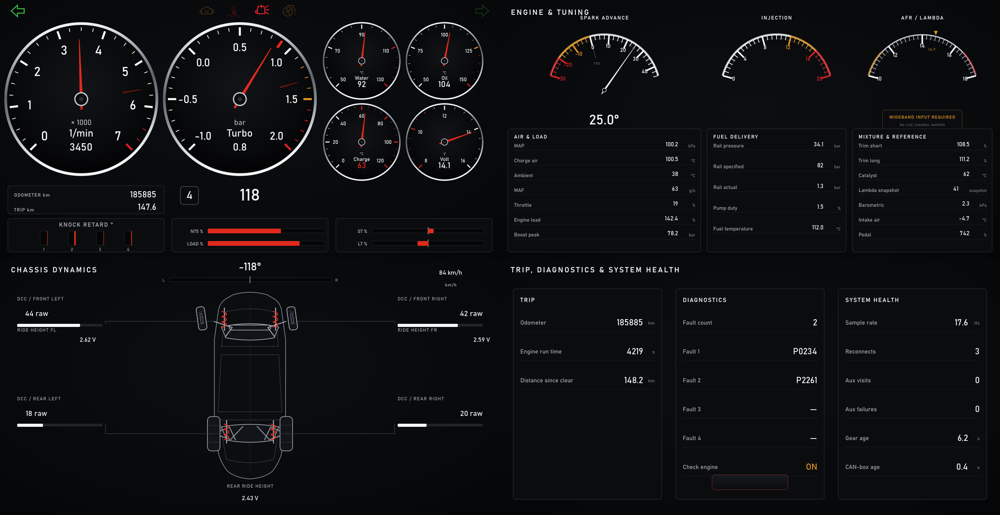

# Scirocco RealDash dashboard

This directory contains the original two-page dashboard and the v2 four-page
rebuild. Read [EDITOR-NOTES.md](EDITOR-NOTES.md) before using the RealDash
editor; it records the selection, colour, asset, aspect-ratio and UWP traps
that are not obvious from RealDash's documentation.

## Current status — 2026-08-26

- `scirocco.rd` is the preserved 80-gauge original. Do not edit it.
- `scirocco-v2.rd` is the working copy. It is still byte-identical to the
  original until the controlled RealDash editor pass is complete.
- All four v2 backgrounds, gauge faces, needles, telltales and wheel assets
  are generated.
- The four native-resolution previews, shared layout, 98-gauge semantic
  manifest, safe rectangle patcher and exact editor runbook are complete.
- The data contract now publishes explicit DCC age/status without renaming
  the historical `steering_counts` CSV channel.
- The remaining work is the RealDash GUI assembly/binding pass and rendered
  behavior verification.

The implementation and acceptance criteria are in
[PLAN-dash-v2.md](PLAN-dash-v2.md). The concise GUI sequence is in
[V2-EDITOR-RUNBOOK.md](V2-EDITOR-RUNBOOK.md).

## Design

V2 is styled after the Mk3 Scirocco cluster and dash-top pod: dead-black
surfaces, restrained chrome rings, cool white markings, red needles and
Bahnschrift/DIN-like typography. It avoids fake data and decorative branding.
The deck canvas is 1280×720; RealDash stores the editor canvas at 1920×1080.

The four pages are:

1. **Driving** — equal-size RPM/boost, four secondary gauges, six live numeric
   readouts, separate RPM/boost ghost needles, boost target, speed/gear,
   trip/odometer, knock, N75/load, centre-out trims and six visible-when-off
   VW/Audi-style telltales.
2. **Engine & Tuning** — live spark advance, a clearly inactive reserved AFR
   face, and coherent Air & Load, Fuel Delivery, Mixture & Exhaust groups.
3. **Chassis Dynamics** — long/narrow Scirocco top view, signed steering,
   schematic front-wheel direction, per-corner raw DCC values/bars, ride
   heights, and explicit DCC availability plus snapshot age.
4. **Trip, Diagnostics & System Health** — trip totals, fault codes/MIL, a
   guarded hold-to-clear command and connection/source health separated from
   the driving and tuning pages.

Preview contact sheet:



## Source files

| file | purpose |
|---|---|
| `layout_v2.py` | sole 1280×720 geometry source; converts to 1920×1080 |
| `generate_assets.py` | parametric SVG generator and deterministic Sharp renderer |
| `make_preview.py` | composes pixel-accurate native-resolution previews |
| `v2_manifest.py` | gauge name → page, channel, rect, asset and settings contract |
| `rd_manifest.py` | read-only `.rd` inventory plus guarded rectangle-only patcher |
| `V2-EDITOR-RUNBOOK.md` | exact GUI move/add/asset/binding sequence |
| `assets/svg/` | generated vector sources and small render wrappers |
| `assets/png/` | bitmaps imported into RealDash |
| `preview/` | page previews and contact sheet |

Edit the generator/layout, not generated SVG/PNG files by hand.

## Regenerate and inspect

From the repository root:

```powershell
python dash/generate_assets.py
python dash/make_preview.py
python dash/v2_manifest.py
python dash/rd_manifest.py dash/scirocco.rd
```

The renderer uses Node.js and the Sharp package (`npm install sharp`, or set
`SCIROCCO_NODE` / `SCIROCCO_SHARP_MJS`) rather than
browser screenshots, so output is deterministic and does not depend on Chrome
or Edge GPU state.

## RealDash-native behavior

Ghost pointers are separate needle gauges bound to the live RPM/boost inputs:

- History Mode `MAX`;
- show time `5 s`;
- transparent `needle_main_ghost.png` asset;
- visibility controlled by RealDash-local `Show Ghost RPM/Boost` values on
  frame `0xC92`.

The live needles do not use History Mode. Boost target remains a third,
independent marker bound to `boost_target`.

The six page-1 round scales use Start Angle `225`, Sweep `270`; Spark uses the
upper-half composition's `285` / `150`. Hide RealDash's generated scale text
because the face/background bitmap owns its markings. Fast signals use 0%
smoothing; thermal/electrical needles and matching numeric readouts start at
80%.

Normal/warning/critical numeric colours are:

- normal `F4F6F7FF`;
- warning `E0951FFF`;
- critical `E02A1CFF`.

RealDash level ranges are safe windows, which matters for battery's two-sided
threshold. Do not use Editing Level `ALL` when setting these three text colours.

Telltales remain at 10–12% neutral graphite opacity when off and reach full
asset colour when active. The turn arrows use the real `turn_left/right` 0/1
inputs from frame `0xC8E`.

The Diagnostics panel uses a native Button Gauge for Clear Codes. It requires
a continuous 2-second hold and drives the project's `0xC90` `Clear Codes`
input with `Hold Value`; releasing returns it to zero. The board refuses the
command whenever road speed is non-zero.

## Chassis data truthfulness

`AUX_ENABLED` remains disabled in production because a DCC visit hard-reset the
board during an engine-running test. V2 does not silently enable it.

Frame `0xC91` is always sent and contains:

- `dcc_age_s`, with `65535` rendered as `--`;
- `dcc_status`: `DCC DATA UNAVAILABLE`, `FRESH`, or `STALE`.

Both DCC blocks must have succeeded for a snapshot to be fresh. The freshness
limit is 30 seconds. DCC numbers and response bars are hidden when status is
unavailable, so zeros cannot masquerade as measurements. Restore production
DCC polling only after the board-reset cause is reproduced and fixed safely in
the car.

## Bench simulation

The simulator now covers all 65 logged channels, including both steering signs,
both turn arrows, four dampers, three ride heights and all four fuel fields.

```powershell
# Terminal 1
python deck/sim_feather.py --fast

# Terminal 2
python deck/tee.py --sim
```

Use `--dcc-stale` or `--dcc-unavailable` on the simulator to verify the two
failure states. RealDash for Windows needs the one-time AppContainer loopback
exemption documented in `EDITOR-NOTES.md` before it can connect to
127.0.0.1:35000.

## Final geometry and deployment

After the editor file contains exactly 98 gauges with correct pages, bindings
and assets, close it and patch only the verified rectangle fields:

```powershell
python dash/rd_manifest.py dash/scirocco-v2.rd `
  --apply-v2-layout dash/scirocco-v2.rd
```

Reopen/save once in RealDash and inspect again. Copy both the final `.rd` and
`board/scirocco_realdash.xml` to the deck, then reselect the XML in the RealDash
connection so the new DCC channels are available.
